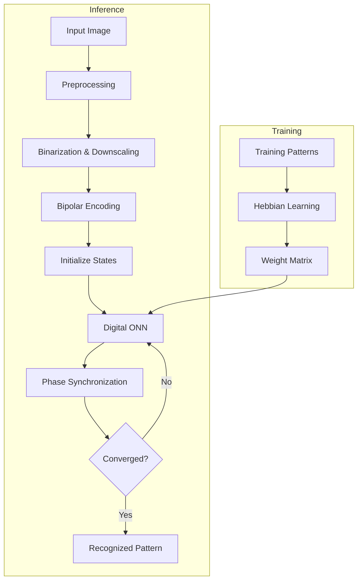

# Digital-ONN-on-FPGA
A fully digital Oscillatory Neural Network (ONN) implemented in Verilog on the Digilent Zybo Z7 FPGA for associative memory-based image recognition. The design uses Hebbian learning to store binary image patterns and performs pattern retrieval through phase-based neural computation.

## What is an Oscillatory Neural Network (ONN)?

An Oscillatory Neural Network (ONN) is a neuromorphic computing architecture in which neurons are represented by coupled oscillators instead of conventional artificial neurons. Information is encoded in the relative phase relationships between oscillators rather than voltage amplitudes. Through synchronization dynamics, the network naturally converges to stored patterns, enabling efficient associative memory and pattern recognition.
## Why Oscillatory Neural Networks?

Compared to conventional neural network implementations, ONNs offer several advantages:

- Phase-based computation instead of amplitude-based logic.
- Intrinsic parallel computation through oscillator synchronization.
- Fast convergence to stored patterns using associative memory.
- Low-power operation, making them suitable for edge AI applications.
- Efficient hardware implementation using FPGA and emerging oscillator technologies.

## Key Features

- Fully digital Oscillatory Neural Network (ONN) implemented in Verilog HDL.
- Designed and deployed on the Digilent Zybo Z7 FPGA.
- Supports associative memory-based image recognition using oscillator synchronization.
- Uses Hebbian associative learning to generate the synaptic weight matrix.
- Tested on both **5 × 3 (15-neuron)** and **10 × 6 (60-neuron)** ONN architectures.
- Validated through functional simulation in Xilinx Vivado and FPGA implementation.
- Scalable architecture for exploring larger ONN-based neuromorphic systems.

## Architecture

  

<b>Figure 1.</b> Architecture of the fully digital Oscillatory Neural Network implemented on FPGA.

The digital ONN is composed of three major modules:

### Control Blocks
- Generate the slow clock required for oscillator operation.
- Serially initialize neuron states using the `serial2states` module.
- Monitor network convergence through `steady_check` and `inconsistent_check` signals.
- Control synchronization and overall network execution.

### Synapse Block
- Stores the Hebbian-trained synaptic weight matrix.
- Computes weighted interactions between all neurons.
- Generates the input (`nin`) for every neuron based on the current network state.
- Implements fully parallel associative coupling across the network.

### Neuron Array
- Consists of identical neuron modules connected through the synapse network.
- Each neuron contains:
  - Phase Calculator
  - Phase-Controlled Oscillator
  - State Register
- Neurons continuously update their phases until the entire network converges to the closest stored pattern.

### Overall Operation
1. The input pattern is serially loaded into the neuron array.
2. The synapse block computes the weighted neuron interactions using the stored Hebbian weights.
3. Each neuron updates its oscillator phase according to the computed inputs.
4. The network iteratively synchronizes until a stable state is reached.
5. The final neuron states represent the retrieved image pattern.

## Implementation Workflow

- The implementation of the Oscillatory Neural Network (ONN) is divided into two primary stages: **offline training** and **online inference**. During the training stage, the digit patterns are first converted into bipolar representations, where binary values are mapped to +1 and −1. These bipolar patterns are then used by the Hebbian learning algorithm to compute the synaptic weight matrix, which captures the associative relationships between all neurons in the network. Since the weight matrix remains constant during inference, it is computed offline and stored in a memory file that is loaded by the FPGA implementation.

- During inference, an input image is first preprocessed to match the dimensions of the implemented ONN architecture. The image is converted into a binary representation, resized to either the **5 × 3 (15-neuron)** or **10 × 6 (60-neuron)** network configuration, and finally transformed into bipolar neuron states. These neuron states are serially loaded into the ONN through the initialization circuitry, providing the starting phase configuration for every oscillator in the network.

- Once initialization is complete, the digital ONN begins its iterative computation. The synapse block continuously evaluates the current state of every neuron using the stored Hebbian weight matrix and computes the weighted input for each neuron. These weighted interactions are then supplied to the neuron modules, where the phase calculator and phase-controlled oscillator update the phase of each neuron based on the collective influence of the entire network. Since every neuron is connected through the synaptic coupling network, all neurons evolve simultaneously toward a common equilibrium state.

- The network repeatedly performs weighted synaptic interactions and phase updates until synchronization is achieved. During each iteration, the control circuitry monitors the neuron states and determines whether the network has reached a stable configuration. If convergence has not yet occurred, the synchronization process continues by repeatedly updating neuron phases. Once a stable synchronized state is detected, the iterative process terminates and the final neuron states represent the retrieved memory pattern.

- The retrieved neuron states are then interpreted as the recognized output image. Because the ONN operates as an associative memory, corrupted or incomplete input patterns naturally converge toward the closest stored pattern rather than reproducing the noisy input. This phase-synchronization mechanism enables robust image recognition while demonstrating the capability of oscillatory neural networks to perform parallel hardware computation using a fully digital FPGA implementation.
