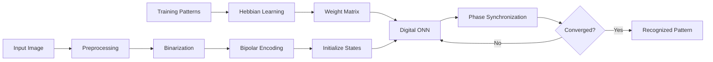
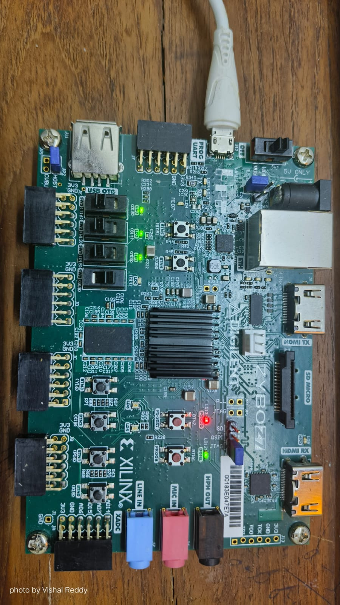
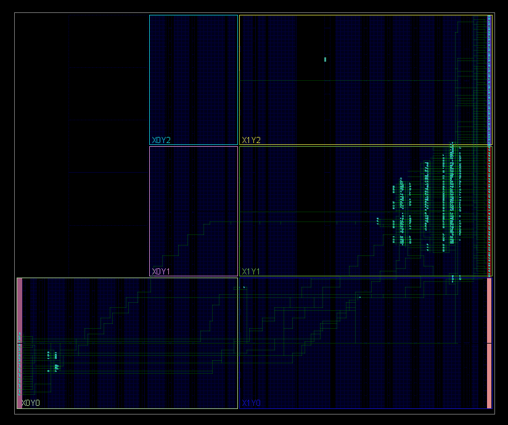

# Digital-ONN-on-FPGA
A fully digital Oscillatory Neural Network (ONN) implemented in Verilog on the Digilent Zybo Z7 FPGA for associative memory-based image recognition. The design uses Hebbian learning to store binary image patterns and performs pattern retrieval through phase-based neural computation.

## 📑 Project Agenda

- [Introduction](#digital-onn-on-fpga)
- [What is an Oscillatory Neural Network (ONN)?](#what-is-an-oscillatory-neural-network-onn)
- [Why Oscillatory Neural Networks?](#why-oscillatory-neural-networks)
- [Key Features](#key-features)
- [Architecture](#architecture)
  - [Control Blocks](#control-blocks)
  - [Synapse Block](#synapse-block)
  - [Neuron Array](#neuron-array)
  - [Overall Operation](#overall-operation)
- [Implementation Workflow](#implementation-workflow)
- [Results](#results)
  - [Functional Simulation](#functional-simulation)
  - [FPGA Implementation](#fpga-implementation)
  - [FPGA Resource Utilization](#fpga-resource-utilization)
- [How to Run](#how-to-run)
- [Future Work](#future-work)
- [References](#references)
## What is an Oscillatory Neural Network (ONN)?

An Oscillatory Neural Network (ONN) is a neuromorphic computing architecture in which neurons are represented by coupled oscillators instead of conventional artificial neurons. Information is encoded in the relative phase relationships between oscillators rather than voltage amplitudes. Through synchronization dynamics, the network naturally converges to stored patterns, enabling efficient associative memory and pattern recognition.
## Why Oscillatory Neural Networks?

Compared to conventional neural network implementations, ONNs offer several advantages:

- Phase-based computation instead of amplitude-based logic.
- Intrinsic parallel computation through oscillator synchronization.
- Fast convergence to stored patterns using associative memory.
- Low-power operation, making them suitable for edge AI applications.
- Efficient hardware implementation using FPGA and emerging oscillator technologies.

## Key Features

- Fully digital Oscillatory Neural Network (ONN) implemented in Verilog HDL.
- Designed and deployed on the Digilent Zybo Z7 FPGA.
- Supports associative memory-based image recognition using oscillator synchronization.
- Uses Hebbian associative learning to generate the synaptic weight matrix.
- Tested on both **5 × 3 (15-neuron)** and **10 × 6 (60-neuron)** ONN architectures.
- Validated through functional simulation in Xilinx Vivado and FPGA implementation.
- Scalable architecture for exploring larger ONN-based neuromorphic systems.

## Architecture

  

<b>Figure 1.</b> Architecture of the fully digital Oscillatory Neural Network implemented on FPGA.

The digital ONN is composed of three major modules:

### Control Blocks
- Generate the slow clock required for oscillator operation.
- Serially initialize neuron states using the `serial2states` module.
- Monitor network convergence through `steady_check` and `inconsistent_check` signals.
- Control synchronization and overall network execution.

### Synapse Block
- Stores the Hebbian-trained synaptic weight matrix.
- Computes weighted interactions between all neurons.
- Generates the input (`nin`) for every neuron based on the current network state.
- Implements fully parallel associative coupling across the network.

### Neuron Array
- Consists of identical neuron modules connected through the synapse network.
- Each neuron contains:
  - Phase Calculator
  - Phase-Controlled Oscillator
  - State Register
- Neurons continuously update their phases until the entire network converges to the closest stored pattern.

### Overall Operation
1. The input pattern is serially loaded into the neuron array.
2. The synapse block computes the weighted neuron interactions using the stored Hebbian weights.
3. Each neuron updates its oscillator phase according to the computed inputs.
4. The network iteratively synchronizes until a stable state is reached.
5. The final neuron states represent the retrieved image pattern.

## Implementation Workflow

- The implementation of the Oscillatory Neural Network (ONN) is divided into two primary stages: **offline training** and **online inference**. During the training stage, the digit patterns are first converted into bipolar representations, where binary values are mapped to +1 and −1. These bipolar patterns are then used by the Hebbian learning algorithm to compute the synaptic weight matrix, which captures the associative relationships between all neurons in the network. Since the weight matrix remains constant during inference, it is computed offline and stored in a memory file that is loaded by the FPGA implementation.

- During inference, an input image is first preprocessed to match the dimensions of the implemented ONN architecture. The image is converted into a binary representation, resized to either the **5 × 3 (15-neuron)** or **10 × 6 (60-neuron)** network configuration, and finally transformed into bipolar neuron states. These neuron states are serially loaded into the ONN through the initialization circuitry, providing the starting phase configuration for every oscillator in the network.

- Once initialization is complete, the digital ONN begins its iterative computation. The synapse block continuously evaluates the current state of every neuron using the stored Hebbian weight matrix and computes the weighted input for each neuron. These weighted interactions are then supplied to the neuron modules, where the phase calculator and phase-controlled oscillator update the phase of each neuron based on the collective influence of the entire network. Since every neuron is connected through the synaptic coupling network, all neurons evolve simultaneously toward a common equilibrium state.

- The network repeatedly performs weighted synaptic interactions and phase updates until synchronization is achieved. During each iteration, the control circuitry monitors the neuron states and determines whether the network has reached a stable configuration. If convergence has not yet occurred, the synchronization process continues by repeatedly updating neuron phases. Once a stable synchronized state is detected, the iterative process terminates and the final neuron states represent the retrieved memory pattern.

- The retrieved neuron states are then interpreted as the recognized output image. Because the ONN operates as an associative memory, corrupted or incomplete input patterns naturally converge toward the closest stored pattern rather than reproducing the noisy input. This phase-synchronization mechanism enables robust image recognition while demonstrating the capability of oscillatory neural networks to perform parallel hardware computation using a fully digital FPGA implementation.

- ## Results

### Functional Simulation

The proposed ONN was functionally verified using Xilinx Vivado. The simulation confirms the correct initialization of neuron states, weighted synaptic interactions, iterative phase synchronization, and convergence to the expected stored pattern. The observed output matches the reference implementation presented in the original ONN architecture.

  

<b>Figure 2.</b> Convergence of a 5x3 15 Pixel corrupted image.

  
  &nbsp;&nbsp;&nbsp;&nbsp;&nbsp;&nbsp;&nbsp;&nbsp;&nbsp;&nbsp;
  

  <b>Figure 3.1.</b>Corrupted Input</b>
  &nbsp;&nbsp;&nbsp;&nbsp;&nbsp;&nbsp;&nbsp;&nbsp;&nbsp;&nbsp;&nbsp;&nbsp;&nbsp;&nbsp;&nbsp;&nbsp;&nbsp;&nbsp;&nbsp;&nbsp;&nbsp;&nbsp;&nbsp;&nbsp;&nbsp;&nbsp;&nbsp;&nbsp;&nbsp;&nbsp;&nbsp;&nbsp;
  <b>Figure 3.2.</b>Retrieved Output</b>

  The pixels have gone under synaptic synchronization and converged to the closest stored pattern i.e 0 in this case.

  

  

<b>Figure 4.</b> Convergence is seen for every different input in case of 2 stored images.

  

<b>Figure 5.</b> We could clearly see that some inputs do not converge to a stable output in case of 3 stored images.

The simulation results show the effect of increasing the number of stored patterns in the ONN. With **two stored patterns**, the network successfully converges to the correct output for all test inputs, demonstrating reliable associative memory behavior.

When the number of stored patterns is increased to **three**, the Hebbian weight matrix experiences greater interference (crosstalk) between the stored memories. This makes it harder for the neuron phases to synchronize to a single stable state, causing some input patterns to converge incorrectly or fail to converge altogether. This illustrates the trade-off between **storage capacity** and **recognition accuracy** in Oscillatory Neural Networks.

Moving to 10x6 ONN simulations.

  

<b>Figure 6.</b> Convergence is seen for all the inputs.

  

<b>Figure 7.</b> Convergence is not seen for all the inputs.

  

<b>Figure 8.</b> Convergence is not seen for many inputs and the converged outputs are very random.

The results obtained with the 10 × 6 ONN follow the same trend observed in the 5 × 3 ONN. When **four patterns** are stored, the network successfully converges to the correct output for all test inputs, demonstrating reliable associative memory performance.

As the number of stored patterns is increased to **five** and **six**, the network begins to experience greater interference between the stored memories. This reduces the ability of the neuron phases to synchronize correctly, causing several inputs to either converge to incorrect patterns or fail to reach a stable state. The results demonstrate that increasing the storage capacity beyond a certain limit leads to reduced recognition accuracy and more random output patterns.

# FPGA Implementation

The verified Digital ONN design was successfully synthesized and implemented on the **Digilent Zybo Z7 FPGA** using **Xilinx Vivado**. Hardware validation confirmed the correct operation of the network, with the recognized neuron states displayed through the onboard LEDs. The implementation demonstrates that the proposed fully digital ONN can be efficiently realized on FPGA hardware while preserving its associative memory behavior.

  

<b>Figure 9.</b> Digilent Zybo Z7 FPGA used for hardware validation of the Digital ONN.

  

<b>Figure 10.</b> FPGA Resource utilization and placement (Vivado).

### FPGA Resource Utilization

| Resource | Utilized | Available | Utilization (%) |
|:---------|----------:|----------:|----------------:|
| LUT       | 1,307 | 53,200  | 2.46 |
| Flip-Flops (FF) | 512 | 106,400 | 0.48 |
| I/O Pins  | 124 | 125 | 99.20 |

## How to Run

1. Clone the repository.
2. Open the Vivado project.
3. Add the RTL source files and constraint file.
4. Generate the Hebbian weight matrix using the Python script.
5. Run functional simulation.
6. Synthesize and implement the design.
7. Program the Zybo Z7 FPGA and verify the output.
   
## Future Work

- Support larger ONN architectures.
- Integrate real-time camera input.
- Explore Storkey learning for improved memory capacity.
- Optimize FPGA resource utilization.
- Investigate analog and memristive ONN implementations.

## References

[1] M. Abernot, T. Gil, M. Jiménez, J. Núñez, M. J. Avellido, B. Linares-Barranco, T. Gonos, T. Hardelin, and A. Todri-Sanial, *Digital Implementation of Oscillatory Neural Network for Image Recognition Applications*, Frontiers in Neuroscience, vol. 15, Art. no. 713054, Aug. 2021. DOI: 10.3389/fnins.2021.713054. :contentReference[oaicite:0]{index=0}

[2] C. Delacour et al., *Oscillatory Neural Networks for Edge AI Computing*, IEEE Computer Society Annual Symposium on VLSI (ISVLSI), 2021.

